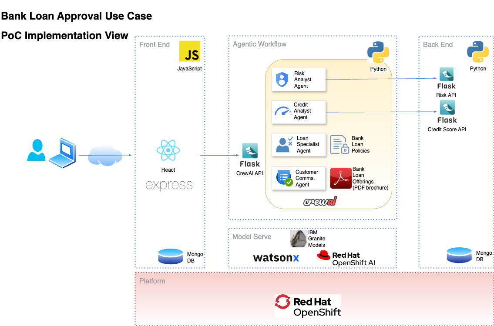

# Finance Use Case - Agentic Workflow

This is the source code of the IBM Developer article published [here](https://developer.ibm.com/articles/agentic-workflows-crewai-openshiftai-watsonxai/)

 Note that this is PoC quality code not meant to be deployed as-is in a production environment. The source code has not been containerized. The code has been tested in a MacBook Pro laptop with macOS Sequoia 15.14 but it could be adapted to other platforms.

There is a separate folder for the back-end, front-end and agentic workflow. Each folder has a README.md file that describes in detail how to stand up the layer. Make sure you carefully follow the instructions in each README.md file.


## Getting Started

1. Clone the repository

    ```bash
    git clone https://github.com/IBM/i-oic-better-together-data-ai-assistants-finance.git
    ```
2. From the **backend** folder, stand up the back-end layer including deploying the MongoDB container, the back-end APIs and loading the sample bank customer data. Follow the README.

3. From the **crewai** folder, stand up the agentic workflow API. Follow the README.

4. From the **frontend** folder, stand up the front-end web application. Follow the README.

## Run the web application

1. Click on the web application URL and register as a new user

2. Login and click on the **Request Personal Loan** button. Fill the loan information form using the customer sample data from the file **backend/api-data.sh**. Pick a sample loan amount and select **Auto** as loan type. Click on the **Submit Loan Request** button.

3. Look at the agentic workflow response. You can request other loans using different customer data. Compare the results between **high** and **low** risk customers (as this is a PoC, there is no need to register and login as different users)

```
``` 


